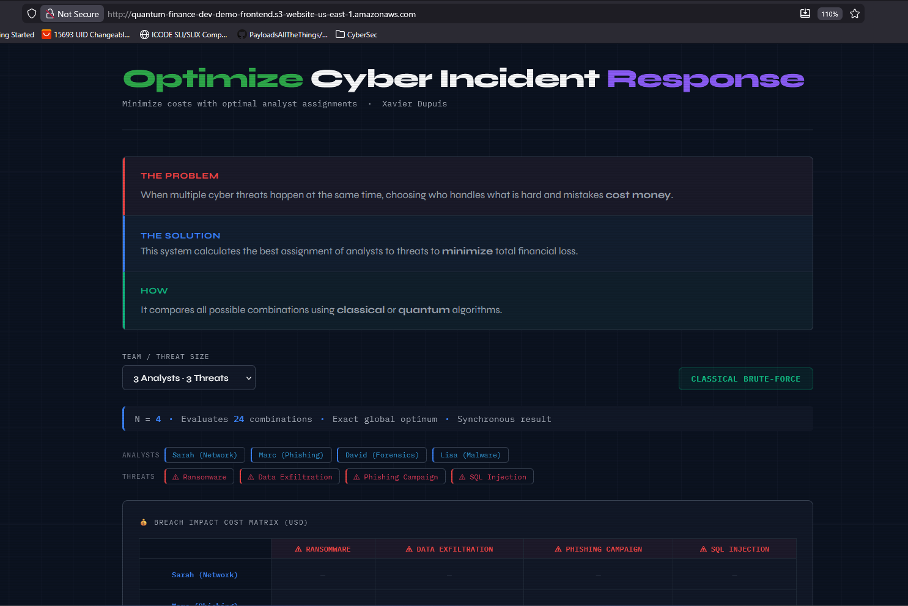
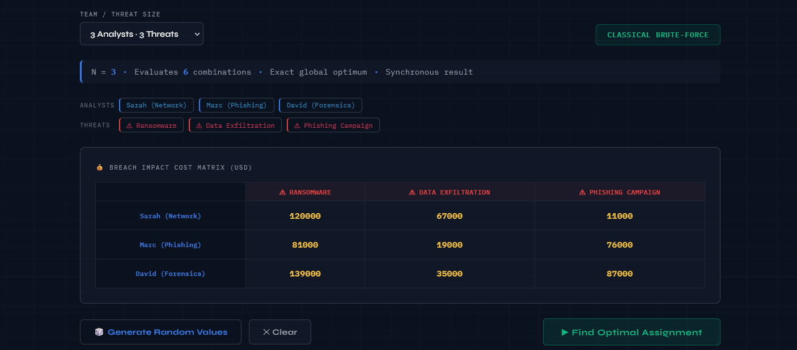
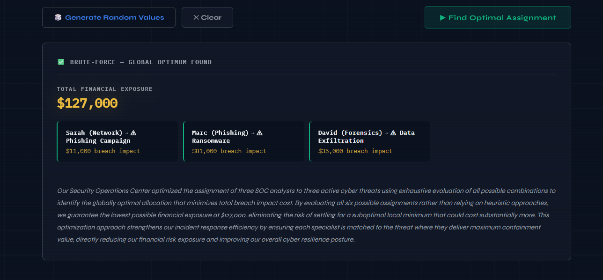
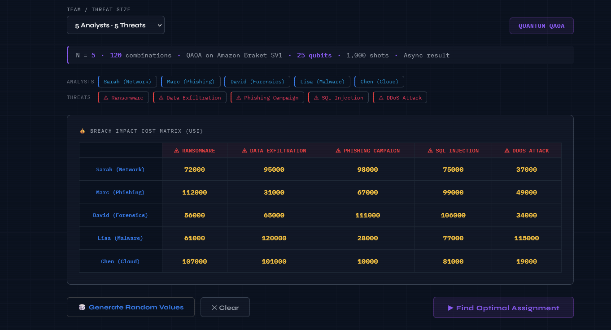
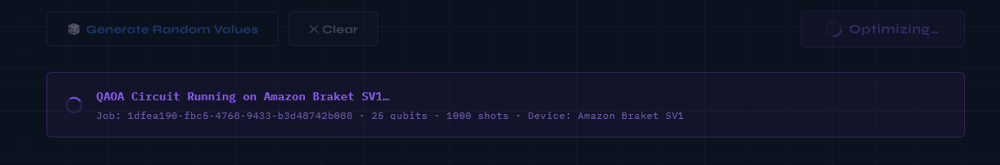
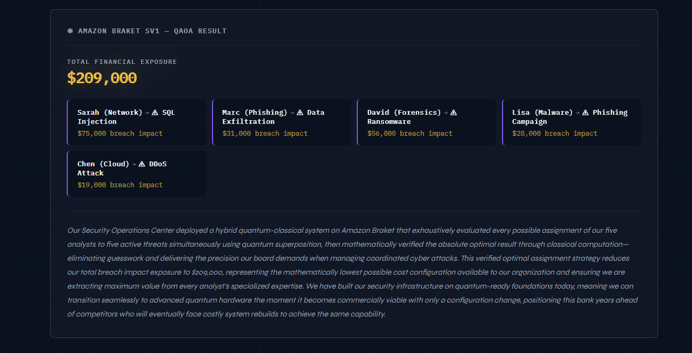
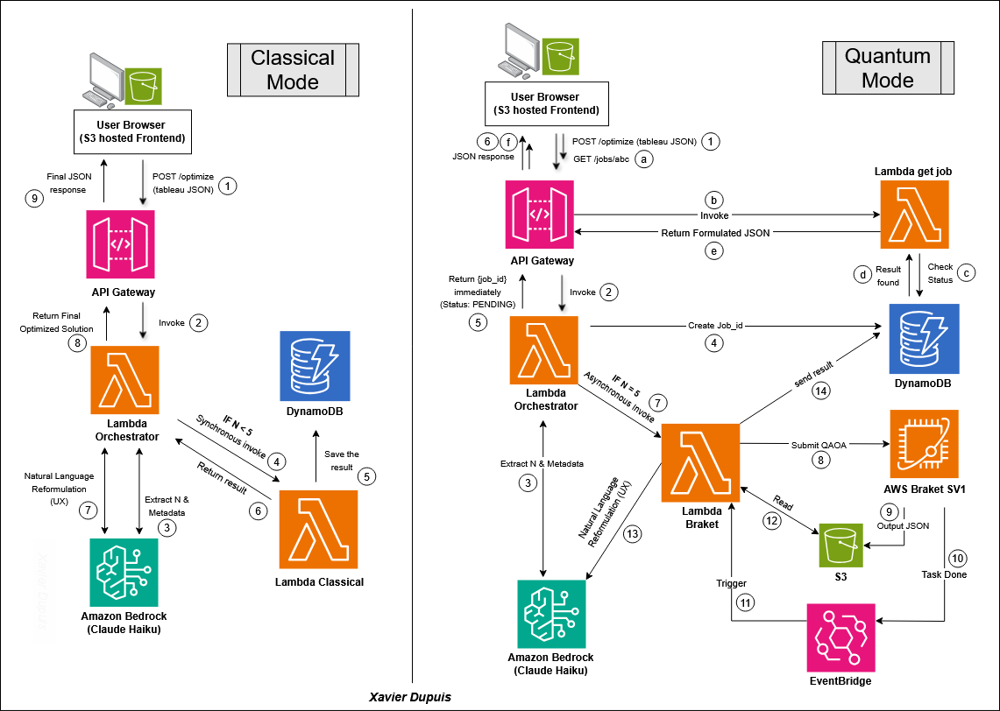

# Optimize Cyber Incident Response
### Assign the right analyst to the right threat

> **A fully automated AWS system that helps a bank respond to multiple cyber threats at once. It uses advanced quantum computing to assign security analysts to incidents in the most effective way, reducing potential financial losses. At the same time, it generates clear, real-time executive summaries using AI, so decision-makers immediately understand the situation.**

---

[](https://aws.amazon.com)
[](https://www.terraform.io)
[](https://python.org)
[](https://aws.amazon.com/braket)
[](https://aws.amazon.com/bedrock)

---

## Table of Contents

- [The Problem](#the-problem)
- [Why This Matters Financially](#why-this-matters-financially)
- [Live Demo](#live-demo)
- [Architecture](#architecture)
- [The Two Paths: Classical vs Quantum](#the-two-paths-classical-vs-quantum)
- [The QAOA Quantum Circuit](#the-qaoa-quantum-circuit)
- [Hybrid Verification Strategy](#hybrid-verification-strategy)
- [Infrastructure as Code](#infrastructure-as-code)
- [Deployment Guide](#deployment-guide)
- [API Reference](#api-reference)
- [Real-World Use Cases](#real-world-use-cases)
- [Future Roadmap](#future-roadmap)
- [Engineering Challenges Solved](#engineering-challenges-solved)
- [Technical Stack](#technical-stack)
- [About](#about)

---

## The Problem

When a bank faces **multiple simultaneous cyber incidents**, managers must rapidly assign analysts under intense pressure. These decisions are often based on judgment rather than a structured approach, leading to inefficiencies.

Because each analyst has specialized expertise and each threat carries a different financial impact, misallocating resources can significantly increase losses and prolong exposure.

```
The Assignment Problem:

           Ransomware  Data Exfil  Phishing  SQL Inject  DDoS
Sarah       $72,000     $95,000     $98,000     $75,000    $37,000   ← Sarah on SQl Injection
Marc       $112,000     $31,000     $67,000     $99,000    $49,000   ← Marc on Data Exfiltration
David       $56,000     $65,000    $111,000    $106,000    $34,000   ← David on Ransomware
Lisa        $61,000    $120,000     $28,000     $77,000   $115,000   ← Lisa on Phishing
Chen       $107,000    $101,000     $10,000     $81,000    $19,000   ← Chen on DDos

Greedy (intuition-based) assignment:  $233,000 total exposure
Optimal assignment:                   $209,000 total exposure
                                       ────────────────────────
Savings from optimization:            $24,000
```

This system finds that optimal assignment, every time, with mathematical guarantees.

---

## Why This Matters Financially

### The Breach Impact Cost Formula

```
Breach Impact Cost = Hourly Financial Loss × Hours to Mitigate
```

Each cell in the N×N cost matrix represents the total dollar cost if a specific analyst handles a specific threat. A network specialist resolves a ransomware incident in 2 hours; an endpoint analyst takes 3 hours -- the difference is **$70,000 in additional breach liability**.

### The Scale Problem

The number of valid analyst-to-threat assignments grows as **N! (N factorial)**:

| Team Size | Permutations      | Classical Time | Quantum Relevance |
|-----------|-------------------|----------------|-------------------|
| N = 4     | 24                | < 1ms          | None needed       |
| N = 5     | 120               | < 1ms          | Architecture demo |
| N = 10    | 3,628,800         | ~1 second      | QAOA starts to help |
| N = 20    | 2.4 quintillion   | Never          | Quantum required  |
| N = 50    | 3 × 10⁶⁴         | Heat death     | Only viable path  |

At N = 5, we can verify QAOA against brute force. At N = 20+, **the classical verification becomes impossible** -- QAOA is the only approach that scales. This system is built today for the infrastructure that matters tomorrow.

### Business Impact

- A financial institution running this optimizer on **one major incident per quarter** saves an estimated **$600,000-$2M annually** from avoided suboptimal assignments *<a href="https://www.ibm.com/reports/data-breach" target="_blank">IBM Cost of a Data Breach Report</a>*
- Regulatory compliance: every assignment decision is **timestamped, auditable, and financially justified** - useful for OSFI, FFIEC, and Basel III incident response documentation
- CISO reporting: Bedrock generates board-level narratives automatically, eliminating 2-3 hours of post-incident communication work per event

---

## Live Demo

**Frontend:** `http://quantum-finance-dev-demo-frontend.s3-website-us-east-1.amazonaws.com`

**API Base:** `https://{api-id}.execute-api.us-east-1.amazonaws.com/`

### Website landing page

<p align="center">
  
</p>

### Classical Example (N=3, instant result)

<p align="center">
  
</p>

**Response (200 OK, ~3 seconds):**

<p align="center">
  
</p>

### Quantum Example (N=5, async QAOA on Braket SV1)

<p align="center">
  
</p>

**Submit Response (202 Accepted):**

<p align="center">
  
</p>

**Poll Response (200 OK, ~90 seconds later):**

<p align="center">
  
</p>

---

## 🗺️ Architecture Visualization

<p align="center">
  
</p>

---

## The Two Paths: Classical vs Quantum

### Classical Path (N ≤ 4) - Guaranteed Optimum

```python
import itertools

def brute_force(cost_matrix):
    n = len(cost_matrix)
    best_cost, best_perm = float("inf"), None
    for perm in itertools.permutations(range(n)):
        cost = sum(cost_matrix[i][perm[i]] for i in range(n))
        if cost < best_cost:
            best_cost, best_perm = cost, list(perm)
    return best_perm, best_cost
```

- Evaluates every permutation - mathematically **guarantees** the global optimum
- N=4 evaluates 24 combinations in microseconds
- Synchronous: result returned in the HTTP response
- Bedrock generates the board narrative in the same call

### Quantum Path (N = 5) - QAOA on Amazon Braket SV1

- Submits a 25-qubit QAOA circuit to Braket SV1
- Returns `202 PENDING` immediately with a `job_id`
- EventBridge fires when Braket completes → Lambda decodes results
- Classical verification guarantees the globally optimal assignment regardless of QAOA approximation quality
- Result available via `GET /jobs/{job_id}` polling

---

## The QAOA Quantum Circuit

The circuit is built in **Braket JAQCD (JSON IR)** format - the native wire format for Braket SV1:

```
Qubits: 25 (N² = 5² encoding - one qubit per analyst-alert pair)
Layers: p = 3 QAOA layers
Shots:  1,000 measurement repetitions

Layer structure per QAOA round:
  ┌─────────────────┐
  │ Hadamard (H)    │ → Superposition: explore all 2²⁵ states simultaneously
  │ on all 25 qubits│
  └────────┬────────┘
           │
  ┌────────▼────────┐
  │ Cost Layer (Rz) │ → Phase shift proportional to breach impact cost
  │                 │   High-cost assignments accumulate negative phase
  │                 │   Low-cost assignments become more probable
  └────────┬────────┘
           │
  ┌────────▼────────┐
  │ Row Constraints │ → CNOT-Rz-CNOT triplets penalize one analyst
  │ (CNOT pairs)    │   covering two alerts simultaneously
  └────────┬────────┘
           │
  ┌────────▼────────┐
  │ Col Constraints │ → CNOT-Rz-CNOT triplets penalize two analysts
  │ (CNOT pairs)    │   assigned to the same alert
  └────────┬────────┘
           │
  ┌────────▼────────┐
  │ Mixer Layer(Rx) │ → Allow quantum state to escape local minima
  │                 │   and explore broader solution space
  └────────┬────────┘
           │ (repeat p=3 times)
           ▼
  ┌─────────────────┐
  │ Measurement     │ → Collapse 25-qubit state to classical bitstring
  │ 1,000 shots     │   Most probable bitstring = best assignment found
  └─────────────────┘
```

**JAQCD gate format (verified against amazon-braket-schemas-python SDK):**

```json
{"type": "h",    "target": 0}
{"type": "rz",   "target": 0, "angle": 0.4}
{"type": "rx",   "target": 0, "angle": 0.6}
{"type": "cnot", "control": 0, "target": 1}
```

---

## Hybrid Verification Strategy

QAOA is an **approximation algorithm** - it finds good solutions, not always the best. This system takes a production-honest approach:

```
QAOA explores → Classical verifies → Best result returned

1. Braket SV1 runs 1,000 shots of the QAOA circuit
2. Most probable bitstring is decoded into an assignment
3. Classical brute-force checks all N! permutations (trivial for N≤5)
4. The verified global optimum is returned to the user
5. The Bedrock narrative includes the QAOA approximation gap %
   (e.g., "QAOA approximation: $246,000 - 33% gap from $184,000 optimum")
```

**Why this matters:** At N = 5 with 120 permutations, verification is instant. At N = 20 with 2.4 quintillion permutations, the classical verification is impossible - **that is precisely why we are building this quantum infrastructure today**. The approximation quality improves with better hardware, more circuit layers, and variational parameter optimization.

---

## Infrastructure as Code

### Key Design Decisions

| Decision | Rationale |
|---|---|
| DynamoDB GSI on `braket_task_arn` | EventBridge completion handler needs to find the job by task ARN - O(1) GSI query vs O(N) table scan |
| `InvocationType="Event"` for Braket Lambda | Braket tasks are async - fire-and-forget avoids orchestrator timeout (90s < Braket Lambda's 300s) |
| `amazon-braket-*` bucket naming | AWS Braket enforces this naming requirement at `CreateQuantumTask` time |
| JAQCD over OpenQASM | Braket SV1 doesn't support `include` statements or all OpenQASM 2.0/3.0 gate names |
| Inference profile ARN | Claude 4.x models require `us.anthropic.*` cross-region inference profile format |
| Hybrid QAOA + brute-force | Guarantees optimal result regardless of QAOA approximation quality |
| TTL on DynamoDB items | Auto-cleanup at 7 days - no maintenance required for demo jobs |

---

## Deployment Guide

### Prerequisites

- AWS CLI configured with appropriate permissions
- Terraform >= 1.7
- Amazon Braket service role created (one-time per account):
  ```
  https://console.aws.amazon.com/braket/home#/permissions?tab=executionRoles
  ```
- Bedrock model access for Claude 4.5 Haiku (`us.anthropic.claude-4-5-haiku-20241022-v1:0`)

### Deploy

```bash
cd rootTerraformCode

# Initialize providers
terraform init

# Review the plan (38 resources)
terraform plan

# Deploy everything
terraform apply
```

**Full deployment time: < 5 minutes**

### Outputs

```
api_url              = "https://{id}.execute-api.us-east-1.amazonaws.com/"
demo_url             = "http://{bucket}.s3-website-us-east-1.amazonaws.com"
dynamodb_table       = "quantum-finance-dev-jobs"
results_bucket       = "amazon-braket-quantum-finance-dev"
lambda_orchestrator  = "quantum-finance-dev-orchestrator"
lambda_classical     = "quantum-finance-dev-classical"
lambda_braket        = "quantum-finance-dev-braket"
lambda_get_job       = "quantum-finance-dev-get-job"
eventbridge_rule     = "quantum-finance-dev-braket-task-complete"
cloudwatch_dashboard = "quantum-finance-dev-dashboard"
```

### Teardown

```bash
terraform destroy
```

---

## API Reference

### `POST /optimize`

Submit an optimization job. Returns synchronously for N ≤ 4, asynchronously for N = 5.

**Request body:**
```json
{
  "analysts":    ["Alice", "Bob", "Carol", "Dave", "Eve"],
  "alerts":      ["SQL Injection", "DDoS", "Ransomware", "Phishing", "Zero-Day"],
  "cost_matrix": [
    [500, 800, 1200, 900,  600],
    [900, 400,  700, 500,  800],
    [1100,600,  300, 700,  900],
    [700, 500,  800, 400, 1000],
    [600, 900,  500, 800,  350]
  ]
}
```

**Constraints:**
- `analysts`, `alerts`, `cost_matrix` must all be N×N (same size)
- N must be between 2 and 5
- N ≤ 4 → classical brute-force, synchronous 200 response
- N = 5 → quantum QAOA, asynchronous 202 response

**Response (N ≤ 4, 200 OK):**
```json
{
  "job_id":     "uuid",
  "status":     "COMPLETE",
  "method":     "CLASSICAL",
  "assignment": [{"analyst": "...", "alert": "...", "cost": 500}],
  "total_cost": 1200,
  "narrative":  "Board-level executive summary from Claude 4.5 Haiku..."
}
```

**Response (N = 5, 202 Accepted):**
```json
{
  "job_id":   "uuid",
  "status":   "PENDING",
  "method":   "QUANTUM",
  "qubits":   25,
  "shots":    1000,
  "message":  "QAOA circuit submitted to Amazon Braket SV1."
}
```

---

### `GET /jobs/{job_id}`

Poll for quantum job completion.

**Response (still running, 202):**
```json
{
  "job_id":  "uuid",
  "status":  "PENDING",
  "message": "Quantum job is still running. Please retry in a few seconds."
}
```

**Response (complete, 200):**
```json
{
  "job_id":     "uuid",
  "status":     "COMPLETE",
  "method":     "QUANTUM",
  "assignment": [{"analyst": "...", "alert": "...", "cost": 16000}],
  "total_cost": "246000",
  "narrative":  "Board-level executive summary..."
}
```

---

## Real-World Use Cases

### Today (Classical Path - Production Ready)

| Use Case | Value |
|---|---|
| Concurrent incident triage | Optimal analyst-to-threat assignment in < 3 seconds, guaranteed global optimum |
| CISO board reporting | Auto-generated executive narrative - no manual translation from technical to business language |
| SOC capacity planning | Quantify the ROI of analyst training: if training reduces a cell from $80k to $30k, the training pays for itself in one incident |
| Regulatory documentation | Timestamped, auditable, financially-justified assignment decisions for OSFI / FFIEC compliance |
| Shift handover briefings | Instant re-optimization when threat priorities change between analyst shifts |

### Near-Term (1-3 Years, Improved Quantum Hardware)

- N = 10-15 analyst teams where classical brute-force becomes impractical
- Portfolio optimization - same mathematical structure as capital allocation across assets
- Multi-cloud security orchestration - matching response playbooks to threat categories at scale
- Supply chain matching - optimal assignment of suppliers, logistics routes, or cloud resources

### Long-Term (Quantum Advantage Era)

- N = 20+ assignments with 2.4 quintillion+ permutations - only viable approach
- Real quantum hardware: one Terraform variable change routes to IonQ Aria, Rigetti Ankaa, or IBM Heron
- Combined with quantum ML for threat classification and risk scoring
- Industry-first quantum-native incident response platforms

> **The bank that builds this infrastructure today will not rebuild from scratch when quantum advantage becomes operational - they will flip a configuration switch.**

---

## Engineering Challenges Solved

> This section documents some of the real production issues hit and resolved while building the AWS infrastructure. These are not theoretical exercises - every error below was encountered during actual deployment and debugged independently.

### Critical Issues

| # | Issue | Root Cause | Fix |
|---|---|---|---|
| 1 | `ValidationException: include statements not supported` | OpenQASM 3.0 `include "stdgates.inc"` rejected by Braket SV1 | Rewrote circuit builder from OpenQASM string generation to JAQCD JSON IR format |
| 2 | `ValidationException: cx gate not supported` | OpenQASM 2.0 `cx` gate name rejected by Braket | Switched to JAQCD; all gates defined as `{"type": "cnot", "control": k1, "target": k2}` |
| 3 | `ValidationException: Provided action is not valid` | JAQCD gate objects used `"gate"` field name - correct field is `"type"` | Verified schema against `amazon-braket-schemas-python` SDK; rebuilt all gate helpers |
| 4 | `ValidationException: results field invalid` | Used `[{"type": "measurement", "targets": [...]}]` in results - measurement is implicit in JAQCD | Changed `results` to `[]`; JAQCD measurement is automatic when shots > 0 |
| 5 | `ValidationException: paradigmParameters is missing` | `CreateQuantumTask` requires `deviceParameters` JSON with `GateModelSimulatorDeviceParameters` | Added `deviceParameters` with `paradigmParameters.qubitCount` and `disableQubitRewiring` |
| 6 | `ValidationException: bucket must start with 'amazon-braket-'` | Braket enforces bucket naming at `CreateQuantumTask` time regardless of IAM | Renamed bucket from `{prefix}-braket-results` to `amazon-braket-{prefix}` in storage module |
| 7 | `ResourceNotFoundException` on `InvokeModel` | Bedrock Haiku 4.5 requires use-case form submission for new accounts | Submitted use case form; switched to Claude 4.5 Haiku as production model |
| 8 | `JSONDecodeError` reading Braket Lambda response | `InvocationType="Event"` returns empty payload - old code called `json.loads(resp["Payload"].read())` | Removed payload read from quantum path; `Event` invocations have no response body |
| 9 | `ValidationException: qubitCount must be between 1 and 34` | N=6 requires 6²=36 qubits; SV1 max is 34 | Reduced max N from 6 to 5; updated orchestrator validation and frontend dropdown |

### Infrastructure Issues

| # | Issue | Fix |
|---|---|---|
| 10 | CloudWatch dashboard `400 InvalidParameterInput - region required` | All 3 dashboard widget `properties` blocks missing `region` field | Added `region = var.aws_region` to every widget; passed `aws_region` through module variables |
| 11 | `messaging/outputs.tf` referenced `braket_job_complete` - resource is `braket_task_complete` | Fixed resource reference name to match actual `aws_cloudwatch_event_rule` declaration |
| 12 | DynamoDB full-table scan on `braket_task_arn` - O(N) cost at scale | Added GSI on `braket_task_arn`; replaced `table.scan()` with `table.query(IndexName=...)` |
| 13 | `templatefile()` crashed on JS `${n}` - treated as Terraform variable | Escaped all JS template literals from `${...}` to `$${...}` in `.tpl` file |
| 14 | `AWSServiceRoleForAmazonBraket` did not exist | One-time console step: Braket → Permissions → Create service role |

### Application Issues

| # | Issue | Fix |
|---|---|---|
| 15 | `get_job` returned `file: null` for all quantum results | Handler read `item.get("files", [])` but DynamoDB stores `alerts` | Replaced `files` → `alerts` key; updated pair dict from `"file"` to `"alert"` |
| 16 | Frontend displayed `$NaN` for per-pair breach costs in quantum results | Quantum path stores assignment as index array - `cost` field not computed on retrieval | Updated `get_job` to load `cost_matrix` from DynamoDB and compute `cost_matrix[i][assignment_indices[i]]` |
| 17 | Bedrock narrative showed `# Board Presentation:` as literal text in UI | Prompt did not prohibit markdown - Claude added headers by default | Added explicit `no markdown, no headers, no bullet points` instruction to Bedrock prompt |
| 18 | QAOA returned $390k vs true optimum of $184k (112% gap) | p=1 layer insufficient for reliable convergence | Increased to p=3 layers; added classical brute-force verification in `handle_complete` - always returns global optimum |
| 19 | Orchestrator timeout (90s) on quantum path | `InvocationType="RequestResponse"` waited up to 300s for Braket Lambda | Changed to `InvocationType="Event"`; orchestrator returns 202 immediately |

---

## Technical Stack

### AWS Services

| Service | Usage |
|---|---|
| **Amazon Braket** | QAOA circuit execution on SV1 simulator (25 qubits, 1,000 shots, JAQCD IR format) |
| **Amazon Bedrock** | Claude 4.5 Haiku via cross-region inference profile for board-level narrative generation |
| **AWS Lambda** | 4 functions (Python 3.12): orchestrator, classical, braket, get_job |
| **Amazon DynamoDB** | Job persistence with PAY_PER_REQUEST billing, TTL, and GSI for O(1) quantum task lookup |
| **Amazon EventBridge** | Braket task state change events → Lambda completion handler |
| **API Gateway (v2)** | HTTP API with CORS, CloudWatch access logging, payload format 2.0 |
| **Amazon S3** | Braket result storage + static website hosting for demo frontend |
| **CloudWatch** | Log groups (7-day retention), multi-function dashboard, metric alarm |
| **IAM** | Least-privilege inline policies, separate roles for standard vs quantum Lambdas |
| **SNS** | Email notifications on orchestrator Lambda errors |

### Infrastructure

- **Terraform** - 10 modules, 38 resources, fully reproducible
- **Python 3.12** - boto3, itertools, json, uuid, decimal handling
- **JAQCD IR** - Braket's native JSON circuit format

### Algorithms

- **QAOA** - Quantum Approximate Optimization Algorithm (p=3 layers)
- **Hungarian-style brute-force** - N! permutation search for classical path and quantum verification
- **Bitstring decoding** - Most-probable measurement → valid assignment with greedy fallback for noisy results

---

## About

**Xavier Dupuis**
Cybersecurity Advisor - Banque Nationale du Canada (Cybsersecurity Advisor)
B.Eng. Cybersecurity Engineering - École Polytechnique de Montréal (Graduating 2026)

**Certifications:**
- AWS Certified Security Specialty
- AWS Solutions Architect Associate
- AWS Cloud Practitioner
- CompTIA Security+
- CompTIA Network+

**What this project demonstrates:**

This deployment goes beyond standard cloud implementations, showcasing the ability to independently engineer and debug bleeding-edge AWS technologies where standard tutorials do not yet exist.

The project demonstrates the ability to:
- Design and deploy production-grade hybrid quantum-classical infrastructure on AWS from scratch
- Debug novel technical problems across many AWS services simultaneously under real deployment conditions
- Apply quantum computing algorithms (QAOA) to a real-world cybersecurity optimization problem
- Communicate complex technical systems in clear, executive-level language via AI-augmented reporting
- Build fully reproducible, modular infrastructure as code across 10 Terraform modules

---

<p align="center">
  <b>Let's build something secure.</b><br>
  <a href="https://www.linkedin.com/in/xavierdupuis/">LinkedIn</a>
</p>
